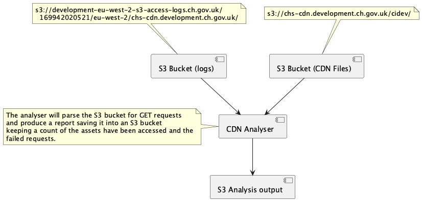

# CDN Analyser

The `CDN Analyser` will:
  - Analyse the asset requests made to the CDN from web applications.
  - Parse the log files stored in an S3 bucket, identifying all the requests made.
  - Produce a list of assets that have not been accessed.
  - Produce a table showing the number of times an asset has been requested
  - Optionally if provided, will combine the table of asset requests from a previous run
  - Be run as an AWS Lambda and will be triggered manually.

## Useful Diagrams

### Component Diagram


## Requirements
In order to run this App locally you will need to install:

- [Java 17](https://www.oracle.com/uk/java/technologies/downloads/#java17)
- [Maven](https://maven.apache.org/download.cgi)
- [Git](https://git-scm.com/downloads)

## Configuration

#### Local Configuration
|                   Key                    |           Example           |                        Notes                        |
|------------------------------------------|-----------------------------|-----------------------------------------------------|
| aws.endpoint                             | http://localstack-main:4566 | localstack-main is the name of the docker container |
| aws.region                               | eu-west-2                   |                                                     |
| aws.access.key.id                        | test                        |                                                     |
| aws.secret.access.key                    | test                        |                                                     |
| aws.s3.path-style-access                 | true                        | Required for local dev use only                     |
| cdn.access.logs.bucket                   | cdn-access-logs             |                                                     |
| cdn.access.logs.filterinpath             | cidev                       |                                                     |
| cdn.access.logs.previousreport           | file-1.csv                  |                                                     |
| cdn.assets.bucket                        | cdn-assets                  |                                                     |
| cdn.assets.filterinpath                  | cidev                       |                                                     |


## Terraform deployment
All dependent AWS resources are provisioned by Terraform and deployed from a concourse pipeline.
Click "plan" then "apply" jobs with desired environment to deploy the lambda.
The pipeline is capable of deploying everything so manual deployment should not be necessary. For
instructions on Terraform provisioning, see [here](/terraform/README.md).

## Running the application

### Locally

1. Read through [developmentNotes.md](/development/developmentNotes.md)
1. `mvn clean package`
2. `cd development`
3. `sam local invoke cdnanalyser -e properties.json --docker-network lambda-local`

### Remotely

#### Cron Job

#### Manually

## Testing the application

## Useful Scripts

[SearchCompaniesHouseRepos](./scripts/SearchCompaniesHouseRepos.js)
```javascript
node SearchCompaniesHouseRepos.js --searchStrings "CDN_URL" "cdnUrlJs" "CDN_URL_JS" "CDN_HOST"
```